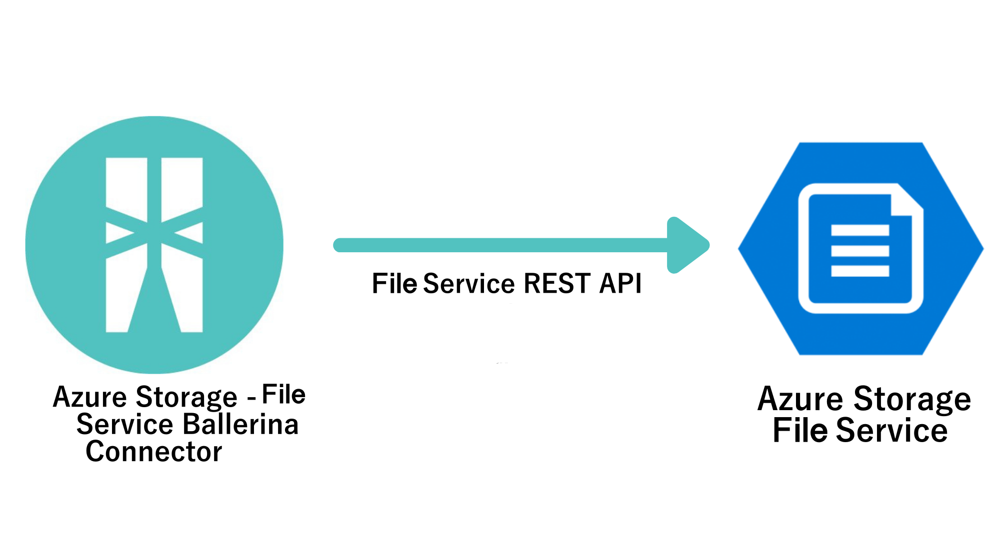

# Ballerina Azure Storage File Service Connector

[](https://github.com/ballerina-platform/module-ballerinax-azure-storage-service/actions?query=workflow%3ACI)
[](https://github.com/ballerina-platform/module-ballerinax-azure-storage-service/commits/master)
[](https://opensource.org/licenses/Apache-2.0)


Connects to Azure Storage File Service using Ballerina.

# Introduction

## What is Azure Storage Service

[Azure Storage Service](https://docs.microsoft.com/en-us/azure/storage/common/storage-introduction) is a highly 
available, scalable, secure, durable and redundant cloud storage solution form Microsoft. There are four types of 
storage which are Blob Storage, File Storage, Queue Storage and Table Storage.

## Azure Storage - Files Service

[Azure File Storage Service](https://docs.microsoft.com/en-us/azure/storage/files/storage-files-introduction)is a shared network file storage service that provides administrators a way to access native SMB file shares in the cloud
Files stored in Azure File service shares are also accessible via REST APIs. 

# Connector Overview

Azure Storage File Service Connector is used to connect to Azure Storage File Service via Ballerina language easily. It is capable to connect to Azure Storage File Service and to execute operations like getFileList, getDirectoryList, createDirectory, directUpload and getFile etc using the FileClient. It is also capable of executing management operations such as createShare and deleteShare etc using the ManagementClient.



This connector will invoke the REST APIs exposed via the Azure Storage File Service. https://docs.microsoft.com/en-us/rest/api/storageservices/file-service-rest-api

For the version 0.1.0 of this connector, version 2019-12-12 of Azure File Storage Service REST API is used.

# Prerequisites

* Azure Account to Access Azure Portal https://docs.microsoft.com/en-us/learn/modules/create-an-azure-account/

* Azure Storage Account https://docs.microsoft.com/en-us/learn/modules/create-azure-storage-account/

* Java 11 Installed
Java Development Kit (JDK) with version 11 is required.

* Ballerina SL Alpha 5 Installed
Ballerina Swan Lake Alpha 5 is required. 

* Shared Access Signature (SAS) or One of the Access Keys for authentication. 


## Supported Versions

|                      |  Version           |
|----------------------|------------------- |
| Ballerina            | Swan Lake Alpha 5  |
| Azure Storage Service|     2019-12-12     |

# Quickstart(s)

## Simple operations in Azure File Service File Client.
These are the simplest scenarios in Azure File Service File Client. You must have the following prerequisites in order 
to obtain these configurations.

* Azure Account to Access Azure Portal https://docs.microsoft.com/en-us/learn/modules/create-an-azure-account/

* Azure Storage Account https://docs.microsoft.com/en-us/learn/modules/create-azure-storage-account/

* You need to get a Shared Access Key or one of the Access Keys from the Azure Portal.


## Step1: Import the Azure Storage Blobs Ballerina Library

First, import the `ballerinax/azure_storage_service.files` module into the Ballerina project. 

```ballerina
    import ballerinax/azure_storage_service.files as azure_files;
```

## Step2: Create Azure File Service Configuration

Create the connection configuration using the Shared Access Signature or Access Key, base URL and account name.

If you are using Shared Access Signature, use the follwing format.

```ballerina
    azure_files:AzureFileServiceConfiguration fileServiceConfig = {
        accessKeyOrSAS: os:getEnv("ACCESS_KEY_OR_SAS"),
        accountName: os:getEnv("ACCOUNT_NAME"),
        authorizationMethod: "SAS"
    };
```

If you are using one of the Access Key, use the follwing format.

```ballerina
    azure_files:AzureFileServiceConfiguration fileServiceConfig = {
        accessKeyOrSAS: os:getEnv("ACCESS_KEY_OR_SAS"),
        accountName: os:getEnv("ACCOUNT_NAME"),
        authorizationMethod: "accessKey"
    };
```

## Step3: Initialize Azure Storage File Client 

Create the FileClient using the configuration you have created as shown above.

```ballerina
    azure_files:FileClient fileClient = check new (fileServiceConfig);
```

## Step4: Try the common operations in Azure Storage File Client

1. Get list of directories in a file share

```ballerina
    var result = fileClient->getDirectoryList(fileShareName = "demoshare");
    if (result is azure_files:DirectoryList) {
        log:printInfo(result.toString());
    } else {
        log:printInfo(result.message());
    }
```

2. Get list of files in a file share

```ballerina
    var result = fileClient->getFileList(fileShareName = "demoshare");
    if (result is azure_files:FileList) {
        log:printInfo(result.toString());
    } else {
        log:printInfo(result.message());
    }
```

3. Create a directory

```ballerina
    var result = fileClient->createDirectory(fileShareName = "demoshare", newDirectoryName = "demoDirectory");
    if (result is boolean) {
        log:printInfo(result.toString());
    } else {
        log:printInfo(result.message());
    }
```

4. Upload a file to a fileshare.

```ballerina
    var uploadResponse = fileClient->directUpload(fileShareName = "demoshare", 
    localFilePath = "resources/uploads/test.txt", azureFileName = "testfile.txt");
    if (uploadResponse is boolean) {
        log:printInfo("upload status:" + uploadResponse.toString());
    } else {
        log:printError(uploadResponse.toString()); 
    }
```

5. Download a file from a fileshare.
```ballerina
    var downloadResponse = fileClient->getFile(fileShareName = "demoshare", fileName = "testfile.txt",
    localFilePath = "resources/downloads/downloadedFile.txt");
    if (downloadResponse is boolean) {
        log:printInfo("Download status:" + UploadResponse.toString());
    } else {
       log:printError(DownloadResponse.toString());
    }
```

## Please check the [sample directory](https://github.com/ballerina-platform/module-ballerinax-azure-storage-service/tree/main/modules/files/samples) for more examples.
